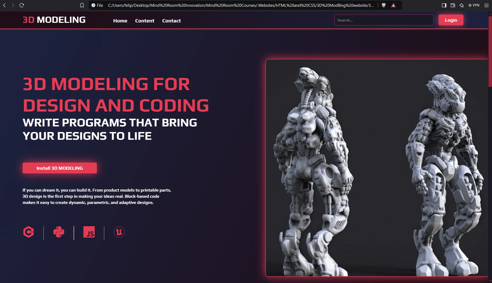
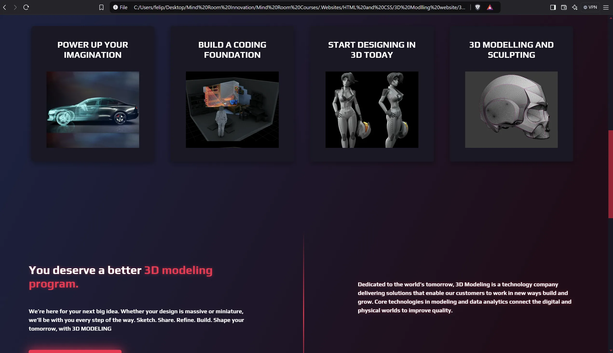
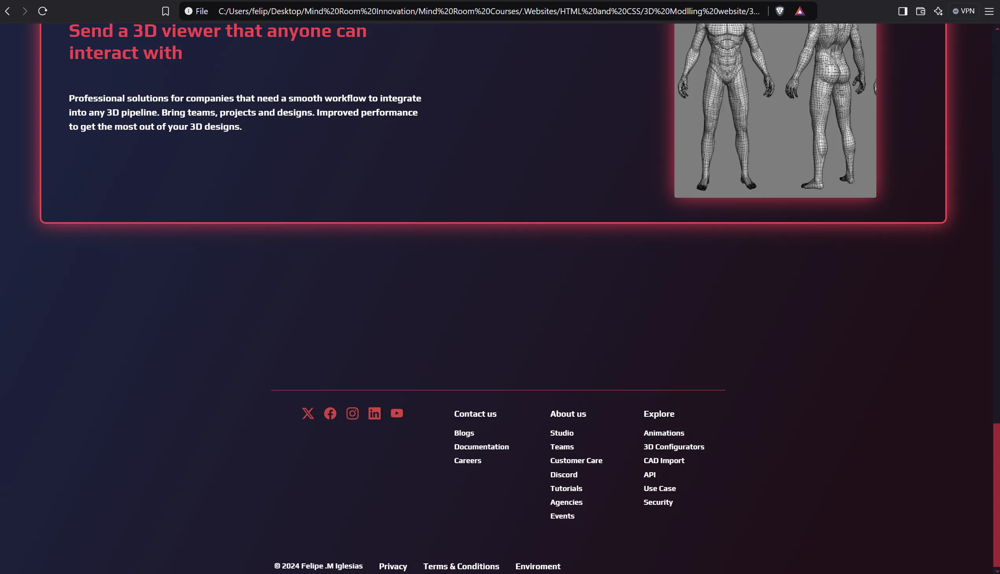
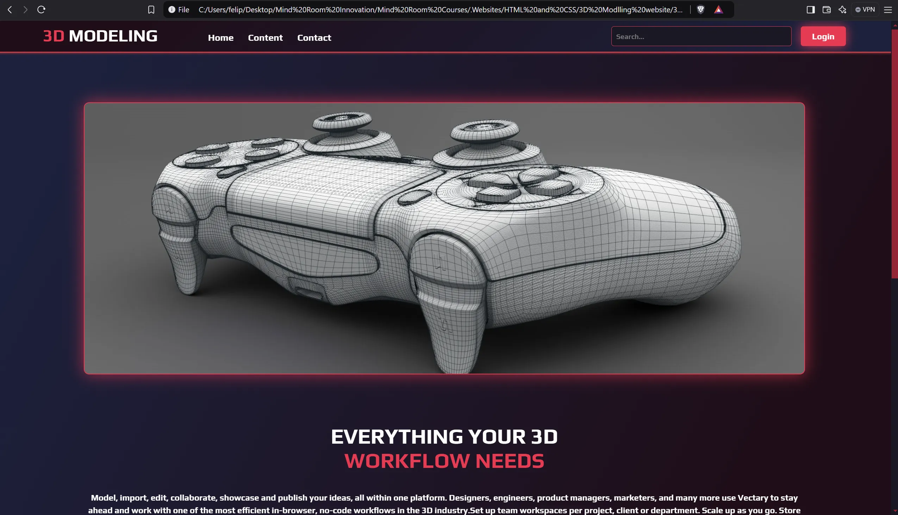
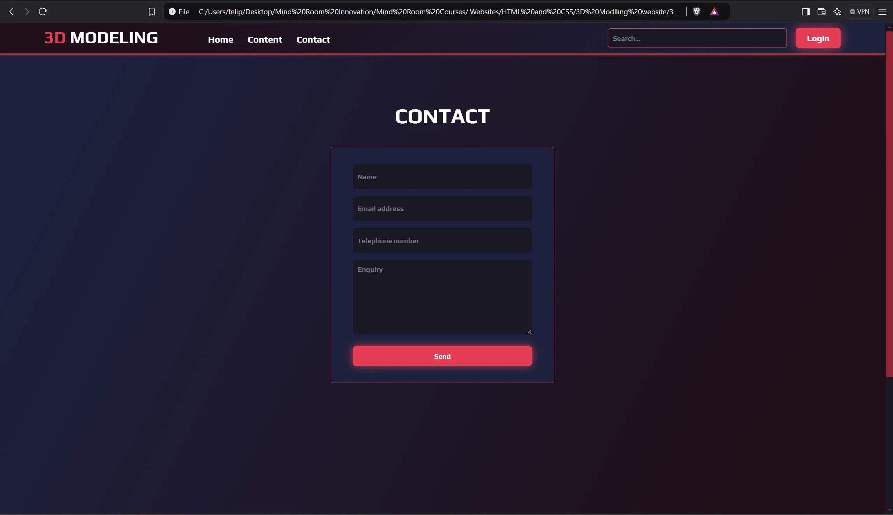

## 📄 Description

This project is designed to use HTML files as templates for a fictitious 3D Modelling Software business. 

To navigate the website**, open the index.html file in your default browser.

* No frameworks
* No AI code
* Local content

**The website is optimized for a 16" 2560 x 1600 screen with a 16:10 aspect ratio.

## 📷 Screenshots

### index.html

### content.html

### contact.html

